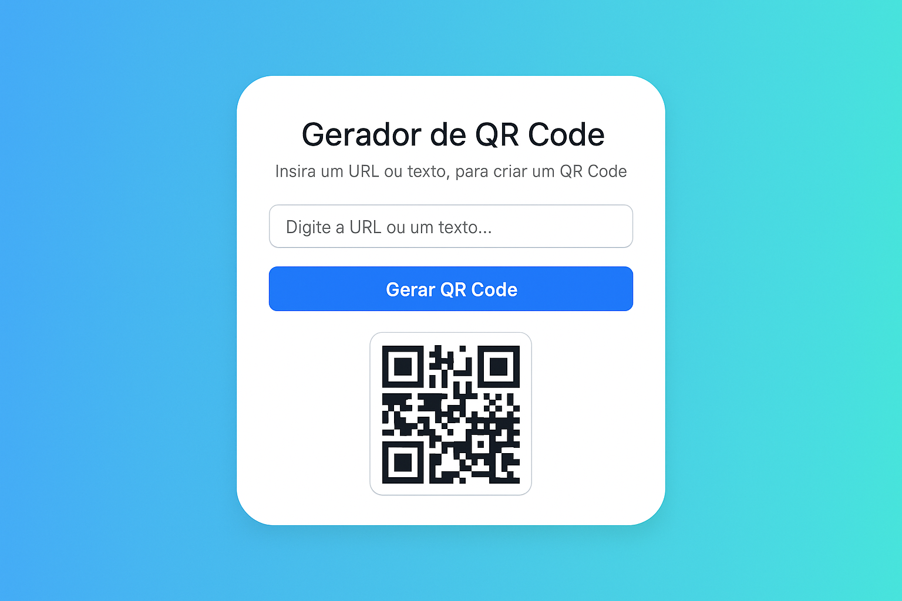

# 📲 QR Code Generator - Simples, Rápido e Visual

  Transforme qualquer texto ou link em um QR Code em segundos! 🔗➡️🧩

Um projeto web leve e intuitivo para gerar QR Codes personalizados usando apenas HTML, CSS e JavaScript. Ideal para estudantes, desenvolvedores iniciantes e qualquer pessoa que queira criar QR Codes de forma rápida e estilosa.

---

  

---

## 🌐 Demonstração Online

🔗 Acesse: [Clique aqui para visualizar o projeto online](https://qrcode-generator-vjeg.vercel.app/)  

---

## 🚀 Funcionalidades

- ✅ Inserção de texto ou URL
- ✅ Geração automática de QR Code via API externa
- ✅ Feedback visual durante o carregamento
- ✅ Reset automático ao limpar o campo
- ✅ Layout centralizado, responsivo e com transições suaves

---

## 🛠️ Tecnologias Utilizadas

- 
- 
- 
- 🌐 API externa: [goqr.me - QR Code Generator](https://goqr.me/api/)

---

## 🧭 Como Usar?

1. Digite um texto ou link no campo indicado.
2. Clique em **“Gerar QR Code”** ou pressione **Enter**.
3. O código será exibido automaticamente.

Se você apagar o conteúdo do campo, o QR Code será ocultado — mantendo a interface limpa e dinâmica.

---

## 👩‍💻 Autora

Desenvolvido por:

**Laura Serbêto**  
🔗 [LinkedIn](https://www.linkedin.com/in/lauraserbeto)  
🎓 Estudante de Engenharia de Software apaixonada por front-end, UI/UX e projetos que unem criatividade e código.

---

